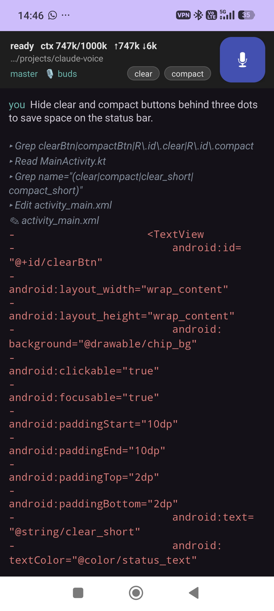
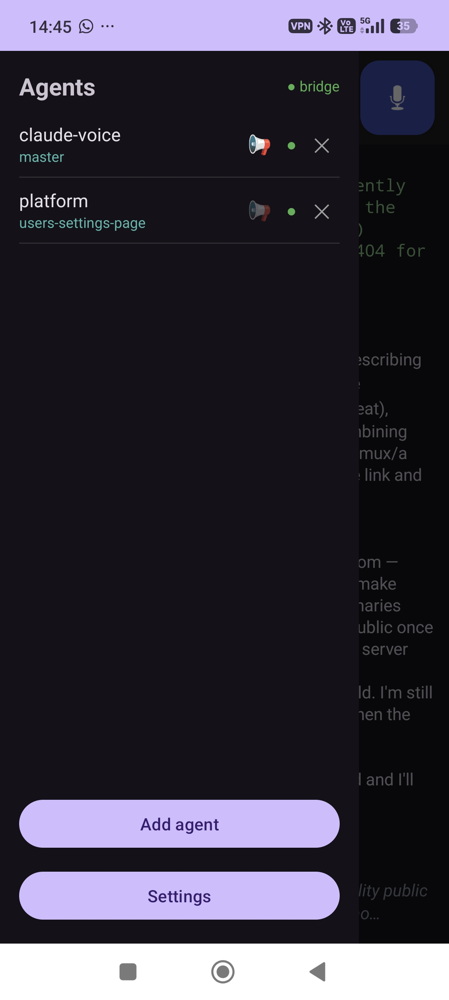
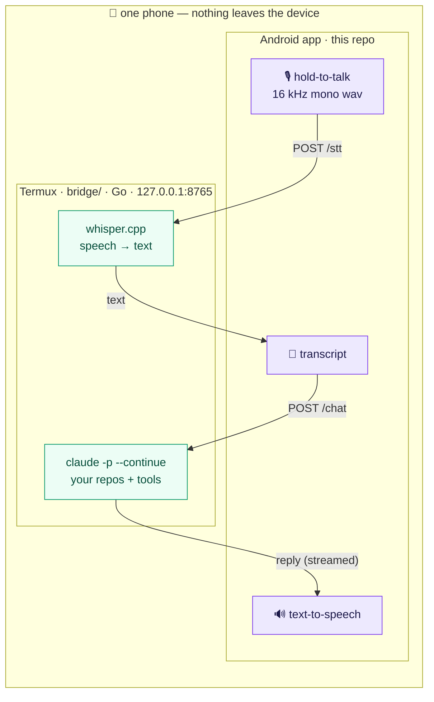

# claude-voice

Talk to a coding agent on your phone. Push to talk, watch the transcript, hear
the reply spoken back. The agent is the `claude` CLI running in Termux on the
same device — so it has your repos and tools — and the app is a thin voice
front-end that reaches it over localhost. Nothing leaves the phone.

  
  &nbsp;&nbsp;
  

## Layout

- `app/` — Android app (Kotlin, minSdk 23): hold-to-talk records 16 kHz mono PCM,
  POSTs to the bridge, shows the transcript, speaks the reply.
- `bridge/` — Termux-side localhost server, a single static Go binary: N agents
  (one per dir), `/stt` via whisper.cpp, `/chat` via the `claude` CLI.
- `.drone.jsonnet` — CI: builds the APK and publishes to GitHub releases on tag.

## Quick start

1. In Termux, build whisper.cpp and put `claude` on `PATH`, then run the bridge
   from your repo: `cd <repo> && ./claude-voice-bridge-arm64` (serves `127.0.0.1:8765`).
2. Install the app APK (CI artifact or local build), open it, confirm the bridge
   URL, grant the mic permission, hold to talk.

## Build

- Bridge: `./bridge/build.sh` — a static `GOOS=android` binary at the repo root.
- App: needs the Android SDK (`compileSdk 34`); CI builds it (see `.drone.jsonnet`).

## Bridge API

| Method | Path        | Body                  | Returns                          |
|--------|-------------|-----------------------|----------------------------------|
| GET    | `/health`   | —                     | `ok`                             |
| GET    | `/agents`   | —                     | `[{id,name,dir,branch,dirty}]`   |
| POST   | `/agents`   | `{"dir":"~/repo"}`    | current agent list               |
| DELETE | `/agents/<id>` | —                  | current agent list               |
| GET    | `/ls?dir=`  | —                     | `{dir,parent,dirs}`              |
| POST   | `/stt`      | WAV bytes             | transcript (whisper.cpp)         |
| POST   | `/chat`     | `{"text","agent":id}` | agent reply, streamed (`claude -p`) |
| GET    | `/voices`   | —                     | Piper voices (`[]` if off)       |
| POST   | `/tts`      | `{"text","voice"}`    | WAV audio (Piper) or 501 if off  |

One agent per directory, each with its own `claude --continue` conversation.

## Config (env)

- `VOICE_PORT` / `VOICE_HOST` — default `8765` / `127.0.0.1`
- `VOICE_PERM` — claude permission mode (default `bypassPermissions`)
- `VOICE_TIMEOUT` — seconds before a stuck turn aborts (default `1800`)
- `VOICE_WORKDIR` — initial agent dir (default: home)
- `WHISPER_BIN` / `WHISPER_MODEL`, and the `PIPER_*` paths

### Piper voices (optional)

Install with `./install-piper.sh` (needs `glibc-runner`). When piper is present at
`~/piper`, the bridge serves `/tts` and `/voices`; otherwise the app falls back to
Android TTS. Add voices by dropping `<name>.onnx[.json]` into `~/piper-voices`.
